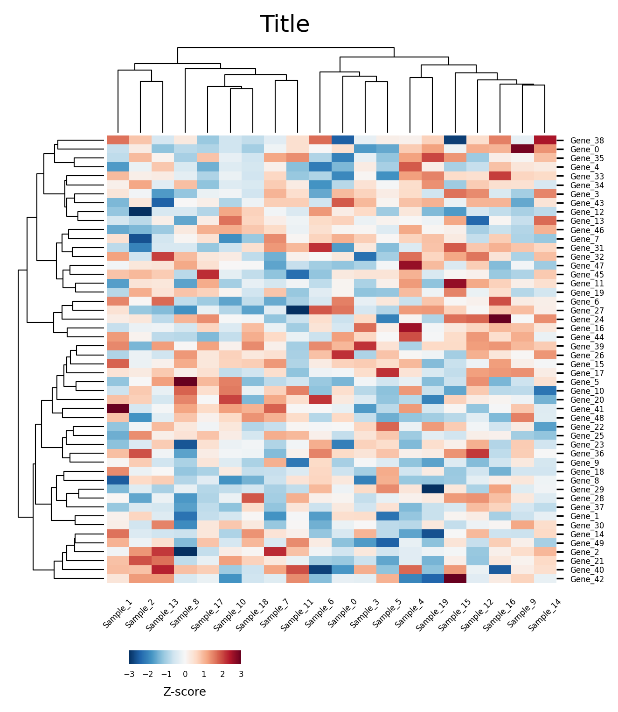

# 聚类基因组热图 (Clustered Genomic Heatmap)

这是一个用于绘制带行列聚类树的基因组学/生物信息学热图的 matplotlib 示例，风格参考了 **DeepTools** 和 **ComplexHeatmap**。

## 📊 效果预览



## ✨ 核心特性

- **双向层级聚类**：内置 `scipy.cluster.hierarchy` 实现，支持对行（如基因）和列（如样本）进行自动聚类并绘制进化-树。
- **自动布局**：通过 `gridspec` 控制聚类树与主热图的间距，确保排版正确。
- **嵌入式色彩条 (Inset Colorbar)**：图表自带嵌入色彩条，并自动生成适合的刻度展示。

## 🚀 快速运行

确保你已经安装了 `matplotlib`, `numpy` 和 `scipy`。然后在当前目录下运行：

```bash
python example.py
```

运行后，图表将自动生成并保存在 `./img/example.png` 和 `./img/example.pdf`。

## 🛠️ 如何配置与替换数据？

打开 `example.py`，您可以通过修改 `main()` 函数中的变量来定制您的图表：

```python
# 1. 文本与显示配置
title = 'Your Plot Title'                # 图表标题
colorbar_label = '$\\log_2$(Value)'     # 色彩条标签 (支持 LaTeX 语法)
vmin, vmax = -3.0, 3.0                  # 颜色映射的上下限 (建议匹配 Z-score 范围)

# 2. 聚类算法配置 (参考 scipy.cluster.hierarchy.linkage)
clustering_algorithm = 'ward'           # 聚类方法：'ward', 'complete', 'average' 等
clustering_algorithm_distance = 'euclidean' # 距离度量：'euclidean', 'correlation', 'cosine' 等

# 3. 数据信息
# heatmap_data: 必需为一个二维数值矩阵 (NumPy 数组)。
# 格式要求：每一行为一个基因/特征，每一列为一个样本/观测值。
# 强烈建议：在传入前对数据进行 Z-score 标准化，以获得清晰的聚类效果。
heatmap_data = np.array([[...], [...]]) 

# 4. 标签信息
gene_names = ['Gene A', 'Gene B', ...]   # 与矩阵行数对应的标签列表
sample_names = ['Sample 1', 'Sample 2', ...] # 与矩阵列数对应的标签列表
```

> **注意**：代码会自动根据聚类结果重排标签顺序，您只需按原始矩阵的顺序提供 `gene_names` 和 `sample_names` 即可。
