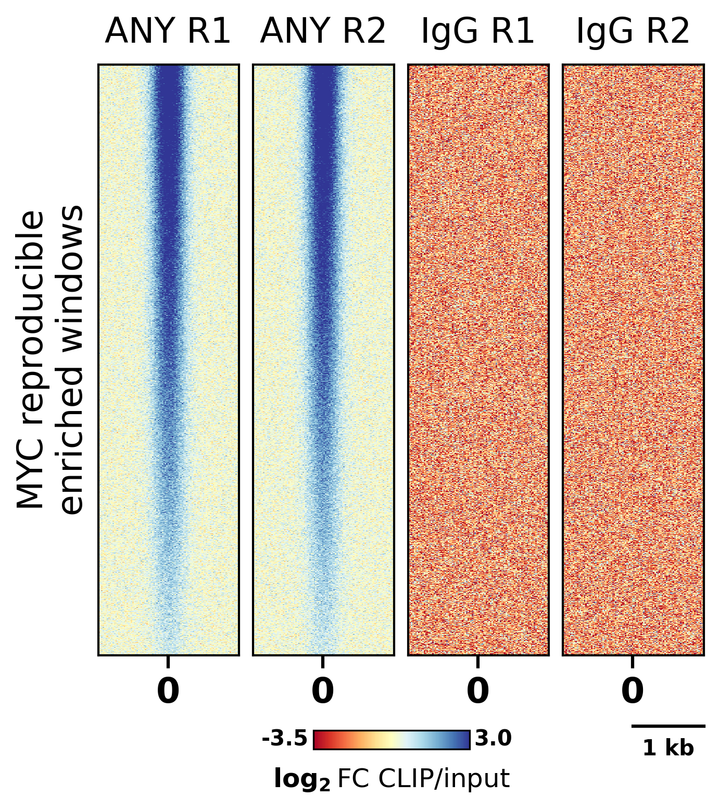

# 基因组学聚合热图 - DeepTools 风格 (Genomic Heatmaps DeepTools Styles)

这是一个用于复刻 Deeptools 单图多表基因组学聚合热图（带有标尺与色彩条图例）的 matplotlib 示例。

## 📊 效果预览



## ✨ 核心特性

- **Deeptool 样式预设**：通过 `assets/genomic_heatmap.mplstyle` 实现了字体、轴线粗细、刻度方向等底层样式的全局接管。
- **聚类数据自动对齐**：默认认为 X 轴为相对位置，并在 0 值上对齐。
- **Colorbar 图例**：提供绘制在图片下放的色彩条图例，最小值与最大值的标签于色彩条左右。
- **标尺**：提供绘制在图表右下角的标尺，支持自定义标尺比例长度与比例标签。

## 🚀 快速运行

确保你已经安装了 `matplotlib` 和 `numpy`。然后在当前目录下运行：

```bash
python example.py
```

运行后，图表将自动生成并保存在 `./img/example.png`。此外代码还会同步输出一份 `.pdf` 格式文件以供高质量学术排版使用。

## 🛠️ 如何替换为你自己的数据？

打开 `example.py`，修改以下几个核心变量即可快速应用到你的研究数据中：

```python
# 热图标题
titles = ['ANY R1', 'ANY R2', 'IgG R1', 'IgG R2']

# Colorbar配置
# red_to_blue 默认为 True，此时低值对应红色，高值对应蓝色。使用 False 则相反。
# vmin, vmax 为最小阈值与最大阈值，你应当确保导入的数据均处于阈值范围内
# colorbar_label 为色彩条标签，支持基本的 LaTeX 语法（参见 matplotlib MathTex）
# scale 为百分比数（所以它应当是小于等于 1.0 的非负数），代表单位长度占热图 X 轴全长的占比。比如 X 轴由 0 至最大正值为你所需的一个单位长度，那么 scale = 0.5，此时比例尺的长度刚好覆盖 X 轴上从 0 至最大值
# scale_label 为比例尺标签，代表单位长度对应的实际物理值，基因组学中一般为碱基数。
red_to_blue = True
vmin, vmax = -3.5, 3.0
colorbar_label = '$\\log_2$FC CLIP/input'
scale = 0.5
scale_label = "1 kb"

# 你的数据，datasets 的元素类型应当是二维的 numpy.ndarray，每行代表一个基因或DNA片段，每列代表相对基因中心的一段DNA序列范围。默认你的数据已经完成了聚类排列。
datasets = []
```