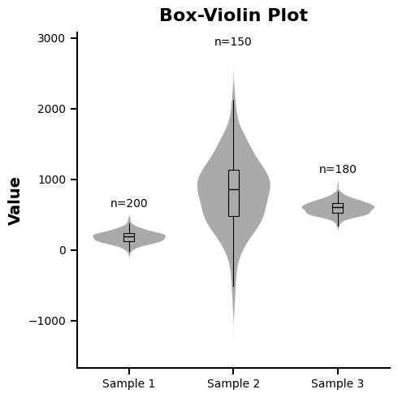
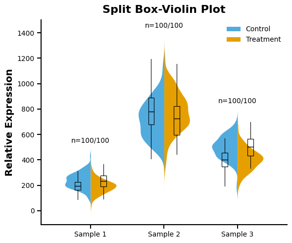

# 单组箱型-小提琴叠加图 (Single Box-Violinplot Chart)

这是一个将 **箱线图 (Boxplot)** 与 **小提琴图 (Violinplot)** 结合的高级图表样式。它既能展示数据分布的整体概率密度（小提琴轮廓），又能精确标定中位数、四分位数等统计学特征（内部黑盒）。该样式深受许多高水平生物医学期刊的青睐。

## 📊 效果预览

### 标准叠加模式 (Standard)

适用于展示单组数据在不同样本间的分布及统计量。



### 分离叠加模式 (Split)

适用于直观对比两组相关样本（如 Control vs Treatment），内部箱线图会自动偏移对齐到对应的半边小提琴图中。



## ✨ 核心特性

*   **样式融合**：通过 `assets/single_box_volinplot_chart.mplstyle` 将小提琴的灰色/彩色背景与内部极简的黑色箱体（白色中位数线）完美结合。
*   **统计信息全覆盖**：外部轮廓展示密度，内部黑盒展示 25%/50%/75% 分位数，胡须展示 1.5x IQR 范围。
*   **样本量标注**：内置 `draw_sample_sizes` 函数，默认在标准模式顶部标注 $n=xxx$。
*   **自动对齐算法**：在分离模式中，内置偏移量逻辑，确保两侧的箱线图精确贴合半边小提琴的几何中心。
*   **Sklearn KDE 重写**：使用 `sklearn.neighbors.KernelDensity` 手动计算核密度，支持多种核函数（gaussian、tophat、epanechnikov 等）。
*   **智能带宽选择**：支持 Scott 和 Silverman 两种带宽估计算法，通过 `bandwidth_algorithm` 参数切换。
*   **尾部延长控制**：`cut` 参数灵活控制密度估计的尾部延伸范围，避免截断分布特征。

## 🚀 快速运行

确保你已经激活了 Conda 环境。然后在当前目录下运行：

```bash
# 生成标准叠加图
python example.py

# 生成分离对比叠加图
python example_split.py
```

运行后，图表将自动生成并保存在 `./img/` 中。

## 🛠️ 如何替换为你自己的数据？

### 修改标准模式 (`example.py`)
打开脚本，在 `main` 函数中调整以下参数：

```python
# --- config ---
title = 'Box-Violin Plot'
ylabel = 'Value'

v_widths = 0.7          # 小提琴图的宽度
b_widths = 0.1          # 内部箱体的宽度（建议设置得比较窄）
show_n = True           # 是否展示样本量 n=xxx
kernel = 'gaussian'     # 核函数: gaussian, tophat, epanechnikov 等
bandwidth_algorithm = 'scott'  # scott 或 silverman
cut = 1.5               # 尾部延长倍数

# --- 模拟数据 ---
data = [
    np.random.normal(200, 80, 200),
    np.random.normal(800, 500, 150)
]
```

### 修改分离模式 (`example_split.py`)
分离模式要求数据为成对的列表：

```python
# --- config ---
kernel = 'gaussian'     # 核函数: gaussian, tophat, epanechnikov 等
bandwidth_algorithm = 'scott'  # scott 或 silverman
cut = 1.5               # 尾部延长倍数

# 每个元素包含 [组1数据, 组2数据]
data = [
    [np.random.normal(200, 50, 100), np.random.normal(250, 60, 100)],
    [np.random.normal(800, 150, 100), np.random.normal(700, 180, 100)]
]
labels = ['Control', 'Treatment'] # 设置图例标签
```
