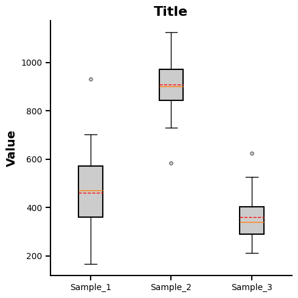

# 单组箱线图 - GraphPad 风格 (Single Boxplot Chart GraphPad Style)

这是一个用于复刻 GraphPad Prism 经典箱线图（包含中位数、均值线、箱体以及离群值点）的 matplotlib 示例。

## 📊 效果预览



## ✨ 核心特性

* **GraphPad 样式预设**：通过 `assets/single_boxplot_chart.mplstyle` 实现了字体、轴线粗细、刻度方向、离群值点样式以及均值线样式（红色虚线）的全局接管。
* **统计信息展示**：默认同时展示中位数（橙色实线）和均值（红色虚线），符合学术图表对数据集中趋势的全面展示要求。
* **高度可定制**：所有的核心线条宽度、颜色和标记点样式都已在样式文件中定义，方便一键应用。

## 🚀 快速运行

确保你已经安装了 `matplotlib` 和 `numpy`。然后在当前目录下运行：

```bash
python example.py
```

运行后，图表将自动生成并保存在 `./img/example.png` 与 `./img/example.pdf` 中。

## 🛠️ 如何替换为你自己的数据？

打开 `example.py`，修改 `main` 函数中的以下部分：

```python
# --- config ---
title = 'Title'     # 你的图表标题
ylabel = 'Value'    # 你的 Y 轴标签
img_name = 'example'# 导出的文件名

show_mean = True    # 是否显示均值线
is_notch = False    # 是否启用箱型切口(Notch)样式

# --- 模拟数据 ---
# 替换为你的真实数据列表
data = [
    np.random.normal(500, 150, 40),
    np.random.normal(900, 100, 40),
    np.random.normal(380, 80, 40)
]

labels = ['Sample_1', 'Sample_2', 'Sample_3'] # X轴的分组标签
```

注意：由于 Matplotlib 的 rcParams 限制，箱体的填充色 (`facecolor`) 目前需要在 `example.py` 的 `ax.boxplot` 调用中通过 `boxprops` 手动指定。
