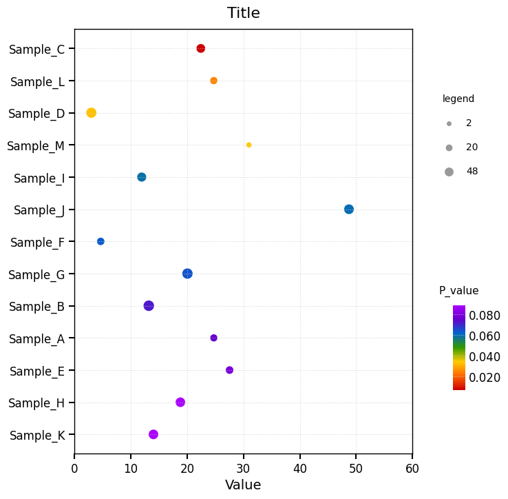

# 气泡图 - R ggplot 风格 (Single Bubble Plot)

这是一个受 R `ggplot2` 启发的气泡图（Bubble Plot）样式，支持颜色映射与大小编码双变量展示，适用于富集分析（如 GO/KEGG）、基因表达等场景。

## 📊 效果预览



## ✨ 核心特性

* **R ggplot 审美**：背景网格线、统一灰色图例散点，复刻 `ggplot2` 常见气泡图风格。
* **双变量编码**：气泡大小代表基因数量/表达值，颜色代表显著性（P 值）。
* **颜色高亮开关**：通过 `color_highlight` 控制是否启用彩色映射，关闭时使用统一灰色调。
* **P 值刻度支持**：内置标准 P 值阈值（0.001、0.005、0.01、0.05、0.1、0.5），通过 `p_value_ticks` 开关切换。
* **智能 X 轴范围**：内置 `calculate_x_lim` 自动计算对齐的 X 轴边界（10/100 取整）。
* **2×2 GridSpec 布局**：主图居左，图例与 Colorbar 分列右侧上下对齐。

## 🚀 快速运行

确保你已经激活了 Conda 环境。然后在当前目录下运行：

```bash
python example.py
```

运行后，图表将自动生成并保存在 `./img/` 中。

## 🛠️ 如何替换为你自己的数据？

打开 `example.py`，修改 `main` 函数中的配置和数据：

```python
# --- config ---
title = 'Title'
color_highlight = True          # 是否启用彩色
p_value_ticks = True             # True: P 值阈值; False: 均匀等分

# --- data ---
categories = [...]               # Y 轴标签列表
x_values = np.array([...])       # X 轴数值
bubble_size_data = np.array([...])  # 气泡大小数据
color_data = np.array([...])     # 颜色映射数据
```
