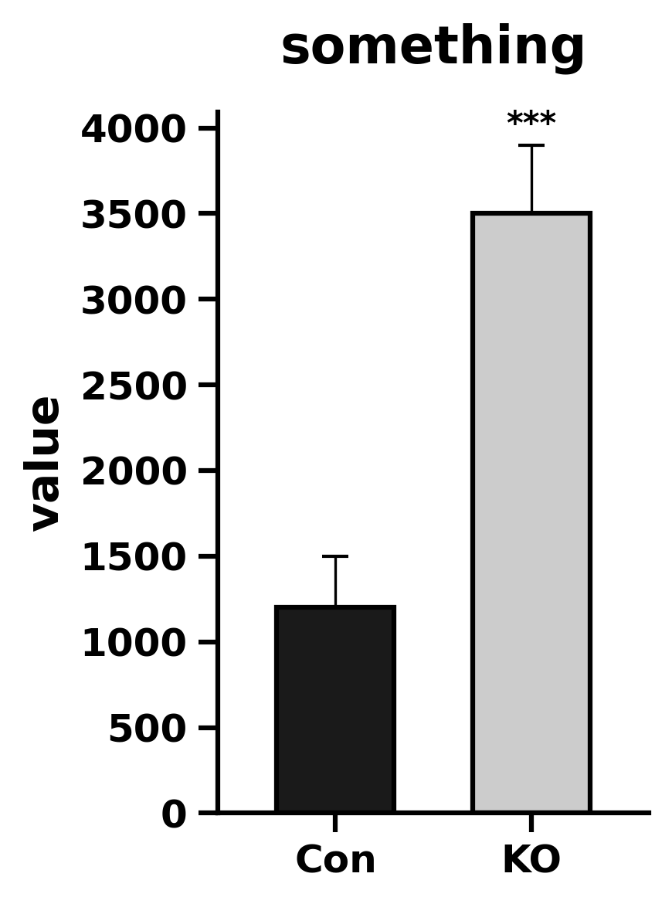

# 柱状图 - GraphPad 风格 (Column Chart GraphPad Style)

这是一个用于复刻 GraphPad Prism 经典双组/多组比较柱状图（带非对称误差线和显著性星号）的 matplotlib 示例。

## 📊 效果预览



## ✨ 核心特性

* **GraphPad 样式预设**：通过 `assets/single_columns_chart.mplstyle` 实现了字体、轴线粗细、刻度方向等底层样式的全局接管。
* **非对称误差线**：默认仅绘制向上的误差线（“T”字型），符合很多生物医学期刊的排版习惯。
* **自动显著性星号定位**：内置 `caculate_star_y_position` 函数，根据柱子高度和误差值自动计算 `***` 的放置高度，避免重叠。

## 🚀 快速运行

确保你已经安装了 `matplotlib` 和 `numpy`。然后在当前目录下运行：

```bash
python example.py
```

运行后，图表将自动生成并保存在 `./img/example.png`。此外代码还会同步输出一份 `.pdf` 格式文件以供高质量学术排版使用。

## 🛠️ 如何替换为你自己的数据？

打开 `example.py`，修改以下几个核心变量即可快速应用到你的研究数据中：

```python
# 1. 文本信息
ylabel = 'Your Y-axis Label'
title = 'Your Plot Title'

# 2. 数据信息
groups = ['Control', 'Treatment A']  # X轴标签
means = [10.5, 25.3]                 # 各组均值
errs = [1.2, 2.5]                    # 各组误差 (SEM或SD)

# 3. 如果你需要完整的“工”字型误差线，修改这里：
# 将 asymmetric_errs = [[0, 0], errs] 改为：
# asymmetric_errs = [errs]

# 4. 请注意，显著性标记的 '*' 应当由你自己设置
# 假如你想对标注显著性的组别、显著性水平进行修改，可以参照下方
# 对第二、三组，分别标注'*****', '**'
draw_stars(ax, groups_id=[2, 3], stars=[5, 2], means=means, errs=errs)
```