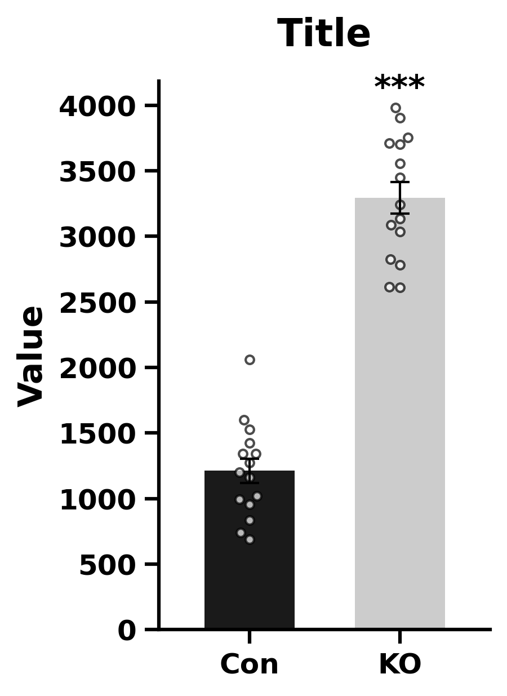

# 柱状散点图 - GraphPad 风格 (Column Scatter Chart GraphPad Style)

这是一个用于复刻 GraphPad Prism 经典柱状散点图（带数据分布点、误差线和显著性星号）的 matplotlib 示例。

## 📊 效果预览



## ✨ 核心特性

* **GraphPad 样式预设**：通过 `assets/single_columns_scatter_chart.mplstyle` 实现了字体、轴线粗细、刻度方向等底层样式的全局接管。
* **智能防重叠散点 (Jitter)**：内置 `generate_jittered_x` 算法，可基于数据的真实 Y 轴值动态计算并错开 X 轴坐标，呈现每个样本点的数据分布。
* **自动显著性星号定位**：内置 `calculate_star_y_position` 函数，算法会自动综合比对均值、误差线高度以及**该组散点的最大极值**，自动计算出安全的 `***` 放置高度，绝对避免星号与数据点重叠。

## 🚀 快速运行

确保你已经安装了 `matplotlib` 和 `numpy`。然后在当前目录下运行：

```bash
python example.py
```

运行后，图表将自动生成并保存在 `./img/example.png`。此外代码还会同步输出一份 `.pdf` 格式文件以供高质量学术排版使用。

## 🛠️ 如何替换为你自己的数据？

打开 `example.py`，修改以下几个核心变量即可快速应用到你的研究数据中：

```python
# 1. 文本信息
ylabel = 'Value'    # 你的 Y 轴标签
title = 'Title'     # 你的图表标题
img_name = 'example'# 导出的文件名
# 是否以边缘包裹
edge = False

# 2. 原始数据信息（需直接提供包含每个样本的数组）
groups = ['Con', 'KO']  # X轴的分组标签

# 将此处替换为你真实的实验数据，接受单组至多组
data_con = np.array([1150, 1200, 1250, ...]) 
data_ko = np.array([3200, 3500, 3600, ...])
raw_data = [data_con, data_ko] 
# 注：程序会自动基于原始数据计算对应的均值 (mean) 和 标准误 (SEM)

# 3. 显著性标记配置
# 格式要求为：(目标组别在 raw_data 中的索引位置, 需打印的星号数量)
# 举例：若要在 KO 组（列表索引为 1）上方打印 "***"
stars_mark = [
    (1, 3) 
]

# 4. 散点大小配置，遵循默认即可
r = 2 
```
