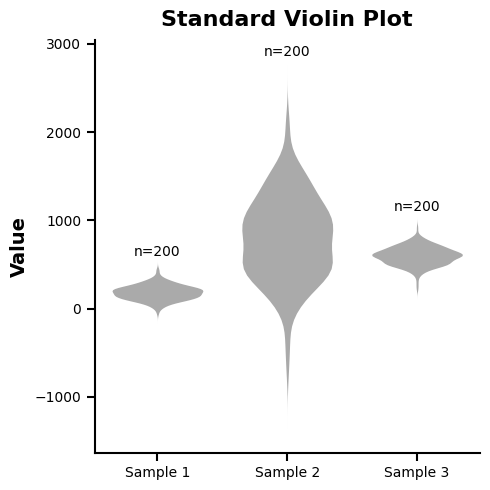
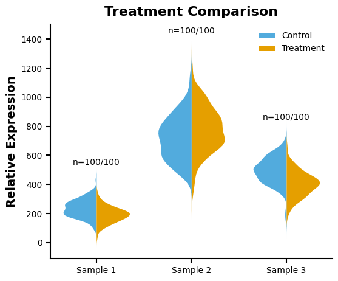

# 单组小提琴图 - GraphPad 风格 (Single Violinplot Chart GraphPad Style)

这是一个专门为生物医学研究设计的 Matplotlib 小提琴图样式，旨在复刻 GraphPad Prism 等专业软件的审美风格，同时支持普通分布展示和组间对比的分离式展示。

## 📊 效果预览

### 标准模式 (Standard)

适用于展示单组数据在不同样本间的分布特征。



### 分离模式 (Split)

适用于在有限的横向空间内，直观对比两组相关样本（如对照组与处理组）的分布差异。



## ✨ 核心特性

*   **GraphPad 审美预设**：通过 `assets/single_violinplot_chart.mplstyle` 全局定义了加粗的坐标轴、向内的刻度线以及符合学术规范的字体设置。
*   **双重变体支持**：
    *   `example.py`: 快速生成经典的单色小提琴图。
    *   `example_split.py`: 生成基于颜色循环（蓝色与橙色对比）的分离式小提琴图，并自动生成图例。
*   **样本量自动标注**：内置 `draw_sample_sizes` 函数，可自动在每个小提琴最上方标注样本数量（标准模式为 $n=xxx$，分离模式为 $n=x/y$）。
*   **Sklearn KDE 重写**：弃用 Matplotlib 内置 violinplot，改用 `sklearn.neighbors.KernelDensity` 手动计算密度，精度更高且支持多种核函数（gaussian、tophat、epanechnikov 等）。
*   **智能带宽选择**：支持 Scott 和 Silverman 两种带宽估计算法，可根据数据分布自动调整核密度平滑程度。
*   **尾部延长控制**：`cut` 参数灵活控制密度估计的尾部延伸范围，避免截断分布特征。
*   **移除冗余元素**：默认隐藏了箱体中心线和末端横线，仅保留轮廓（可根据需要开启），使图表视觉焦点更加集中。

## 🚀 快速运行

确保你已经激活了 Conda 环境。然后在当前目录下运行：

```bash
# 生成标准小提琴图
python example.py

# 生成分离对比小提琴图
python example_split.py
```

运行后，图表将自动保存在 `./img/` 文件夹下。

## 🛠️ 如何替换为你自己的数据？

### 修改标准模式 (`example.py`)
在 `main` 函数中修改数据列表及配置：
```python
# --- config ---
show_n = True  # 是否展示样本量 n=xxx
kernel: KernelType = 'gaussian'       # 核函数: gaussian, tophat, epanechnikov 等
bandwidth_algorithm: BandwidthAlgorithm = 'scott'  # scott 或 silverman
cut = 1.5  # 尾部延长倍数

# --- data ---
data = [
    np.random.normal(200, 80, 200),
    np.random.normal(800, 500, 200),
    np.random.normal(600, 100, 200)
]
```

### 修改分离模式 (`example_split.py`)
分离模式要求数据格式为成对列表：
```python
# --- config ---
show_n = True  # 是否展示样本量 n=x/y
kernel: KernelType = 'gaussian'       # 核函数: gaussian, tophat, epanechnikov 等
bandwidth_algorithm: BandwidthAlgorithm = 'scott'  # scott 或 silverman
cut = 1.5  # 尾部延长倍数

# 每个元素代表一个样本点，包含 [组1数据, 组2数据]
data = [
    [np.random.normal(200, 50, 100), np.random.normal(250, 60, 100)],
    [np.random.normal(800, 150, 100), np.random.normal(700, 180, 100)]
]
labels = ['Control', 'Treatment'] # 设置图例标签
```
